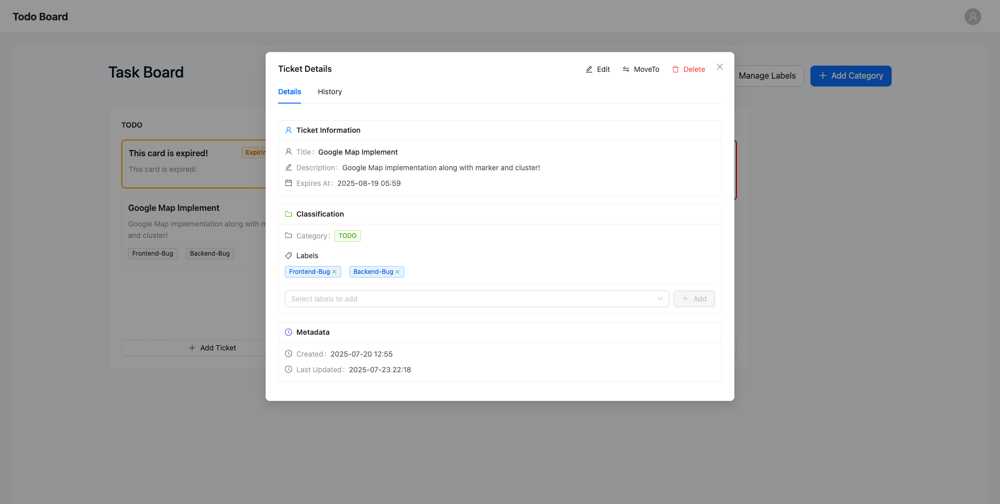

# TODO Project Frontend

This is the frontend for the TODO project, built with React, TypeScript, and Vite.

## Features

- [x] Login
- [x] Register
- [x] Create category/column
- [x] Delete category (with option to move tickets to another category or delete them)
- [x] Add/Edit/Delete ticket
- [x] Label management (add/edit/delete labels)
- [x] Drag and drop tickets between categories
- [x] Ticket description draft is saved in cache if editing is interrupted
- [x] Expire card logic (shows expiring/expired status)
- [x] Ticket history (view all status/category changes)
- [x] Responsive design

## How to run this project :

1. **Clone the repository:**

   ```sh
   git clone https://github.com/your-username/your-repo-name.git
   cd your-repo-name
   ```

2. **Copy environment variables:**

   ```sh
   cp .env.example .env
   ```

   Edit `.env` if needed. Make sure the backend API URL/port matches your backend server.

3. **Install dependencies:**

   ```sh
   npm install
   ```

4. **Start the development server:**
   ```sh
   npm run dev
   ```

The app will be available at the URL shown in your terminal (usually http://localhost:5173).

> **Note:**
> Ensure the backend port and API URL in your `.env` file match your backend server configuration.

## Application Images

### Task Board


### Label Management


### Ticket Details



### Ticket History


---
